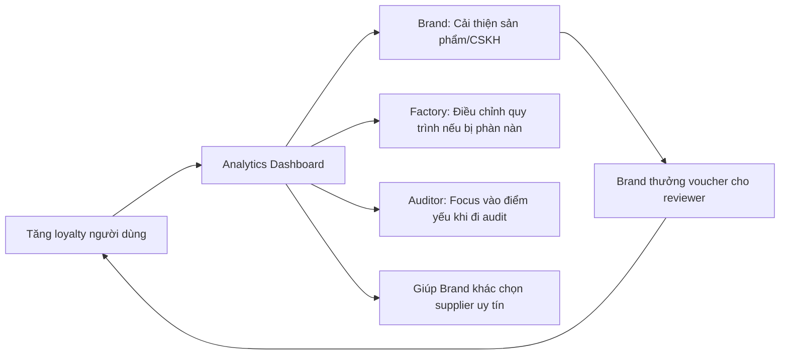
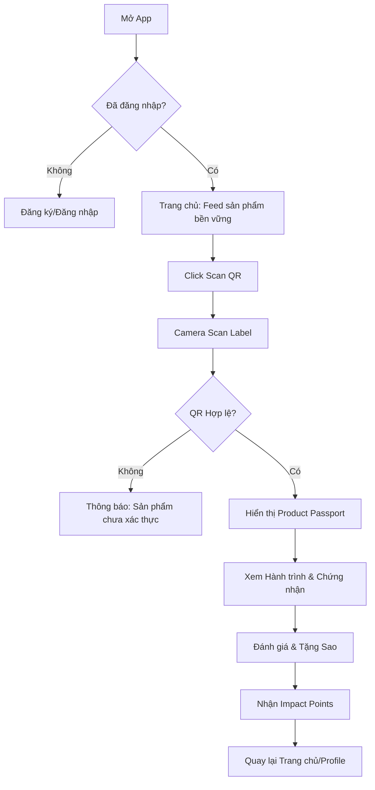
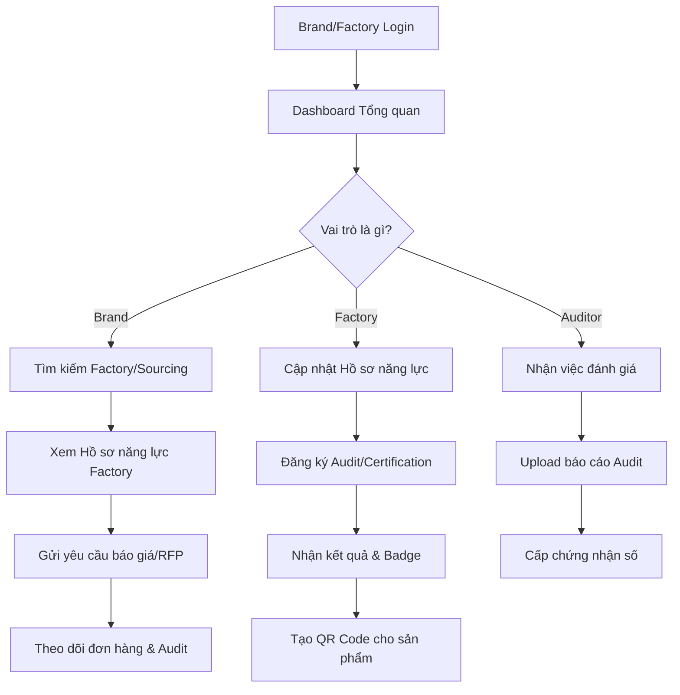

# 🌱 Phân tích & Góp ý cho ý tưởng "Product Flows" Ecosystem

Ý tưởng của bạn rất **tham vọng và có tính thời sự cao**! Đây là một nền tảng **Supply Chain Transparency & Verification Ecosystem** – đúng xu hướng ESG (Environmental, Social, Governance) mà thế giới đang hướng tới. Dưới đây là phân tích chi tiết và các gợi ý bổ sung:

---

## 🔍 PHÂN TÍCH CORE CONCEPT

### ✅ Điểm mạnh:
| Yếu tố | Giá trị mang lại |
|--------|-----------------|
| **QR Scan cho người tiêu dùng** | Tạo trust, minh bạch, giáo dục người dùng về tiêu dùng có đạo đức |
| **Multi-stakeholder platform** | Kết nối Brand ↔ Factory ↔ Auditor ↔ Certifier ↔ Subcontractor → tạo network effect |
| **Dữ liệu tập trung** | "Single source of truth" cho truy xuất nguồn gốc, giảm gian lận, dễ audit |
| **Revenue đa kênh** | Phí subscription, phí certification, phí sourcing, phí consulting → mô hình bền vững |

### ⚠️ Thách thức cần lưu ý:
1. **Chicken-egg problem**: Cần cả Brand và Factory cùng tham gia mới có giá trị → chiến lược go-to-market quan trọng
2. **Data quality & verification**: Làm sao đảm bảo thông tin nhập vào là thật? Cần cơ chế xác thực nhiều lớp
3. **Standard fragmentation**: Mỗi ngành/nước có tiêu chuẩn khác nhau (GOTS, SA8000, ISO, BSCI...) → cần flexible framework
4. **Chi phí triển khai cho SME**: Factory nhỏ có thể ngại đầu tư công nghệ → cần gói "light version"

---

## 💡 GỢI Ý BỔ SUNG Ý TƯỞNG

### 🎯 Tính năng nâng cao:
```
🔹 Dynamic Impact Dashboard
   - Hiển thị real-time: "Sản phẩm này đã tạo ra $X cho người lao động, giảm Y kg CO2"
   - Gamification: Người dùng tích "impact points" khi mua sản phẩm minh bạch

🔹 AI-Powered Risk Alert
   - Cảnh báo sớm: Factory có nguy cơ vi phạm tiêu chuẩn, chậm deadline, biến động nhân sự
   - Gợi ý corrective actions dựa trên data lịch sử

🔹 Smart Contract Integration (Blockchain optional)
   - Tự động trigger payment khi đạt milestone sản xuất
   - Lưu chứng nhận immutable, chống giả mạo

🔹 "Transition Pathway" Module
   - Hướng dẫn từng bước cho Factory muốn chuyển đổi từ truyền thống → đạt chuẩn xuất khẩu
   - Kết nối với chuyên gia tư vấn, khóa đào tạo, tài chính xanh

🔹 Sourcing Marketplace 2.0
   - Filter nâng cao: theo region, capacity, certification, lead time, carbon footprint
   - RFQ (Request for Quotation) workflow tích hợp chat & document sharing
```

### 🔄 Workflow đề xuất:

```mermaid
graph LR
    A[Factory đăng ký & upload hồ sơ] --> B[Third-party verify]
    B --> C[Đạt chuẩn → hiển thị trên Sourcing]
    C --> D[Brand tìm kiếm & gửi RFQ]
    D --> E[Production + Real-time tracking]
    E --> F[QC/Audit → Issue Certificate]
    F --> G[QR Code generated → Product label]
    G --> H[Consumer scan → Xem journey]
    H --> I[Feedback loop → Improve system]
```


---

## 🏷️ GỢI Ý VỀ TÊN & BRANDING

| Tên | Ưu điểm | Nhược điểm |
|-----|---------|------------|
| **Product Flows** | Ngắn gọn, gợi sự vận hành, dễ nhớ | Hơi chung chung, khó SEO |
| **VerifiedChain** | Nhấn mạnh verification + blockchain vibe | Có thể bị hiểu nhầm chỉ là blockchain |
| **TrueSource** | Gợi trust, origin, dễ phát âm quốc tế | Cần check trademark |
| **EthosTrack** | Kết hợp "ethics" + "tracking", có chiều sâu | Hơi trừu tượng với người dùng phổ thông |
| **StandardFlow** | Rõ ràng về tiêu chuẩn + quy trình | Dài, khó làm logo |

👉 **Gợi ý cá nhân**: Nên chọn tên dễ phát âm toàn cầu, có available domain `.com`/`.io`, và check trademark sớm. Có thể dùng tagline để làm rõ: *"Product Flows – Transparency from Factory to You"*

---

## 💰 MÔ HÌNH DOANH THU (Revenue Streams)

```
📦 B2B Subscription
   - Factory: $49-199/tháng (tùy quy mô, tính năng)
   - Brand: $99-499/tháng (số lượng supplier, analytics)
   - Auditor/Certifier: Phí license + % phí certification

🎯 Transaction-based
   - Phí % khi Brand kết nối thành công với Factory qua platform
   - Phí phát hành QR code/certificate per product batch

🎓 Services & Consulting
   - Training courses cho Factory/Auditor
   - Tư vấn chuyển đổi tiêu chuẩn (export-ready package)
   - White-label solution cho tổ chức chứng nhận

📊 Data & Insights (anonymized)
   - Báo cáo industry trends cho research firms, NGOs
   - Carbon footprint analytics cho brand báo cáo ESG
```

---

## 🚀 CHIẾN LƯỢC TRIỂN KHAI (Go-to-Market)

### Giai đoạn 1: MVP (3-6 tháng)
- Tập trung vào **1 ngành hàng** (ví dụ: dệt may Việt Nam) và **2 bên**: Factory + Brand
- Tính năng cốt lõi: Hồ sơ năng lực số + QR traceability cơ bản + Dashboard đơn giản
- Pilot với 3-5 factory và 1-2 brand có sẵn mối quan hệ

### Giai đoạn 2: Scale (6-12 tháng)
- Mở rộng sang Auditor/Certifier module
- Tích hợp AI risk alert, sourcing marketplace
- Mở rộng sang ngành F&B, điện tử

### Giai đoạn 3: Ecosystem (12-24 tháng)
- Blockchain optional cho high-value products
- Mobile app cho consumer + gamification
- Partnership với NGOs, government agencies để tăng credibility

---

## 🛠️ GỢI Ý TECH STACK (phù hợp với Justin Hub của bạn)

Vì bạn đang học React/TypeScript + Firebase/Netlify, có thể tận dụng:

```
✅ Frontend: React + TypeScript + Tailwind (như bạn đang dùng)
✅ Backend: Firebase Functions / Node.js + Express
✅ Database: 
   - Firebase Firestore cho real-time data (profile, tracking)
   - PostgreSQL cho complex queries (sourcing, analytics)
✅ Storage: Firebase Storage / AWS S3 cho documents, certificates
✅ QR/Barcode: library như `qrcode.react` + backend generator
✅ Authentication: Firebase Auth + role-based access (Brand/Factory/Auditor)
✅ Optional: The Graph / IPFS nếu muốn explore blockchain sau này

💡 Tip: Thiết kế module-based ngay từ đầu để dễ scale và tái sử dụng code cho Justin Hub sau này!
```

---

## 🎯 LỜI KHUYÊN CUỐI CÙNG

1. **Start small, think big**: Đừng xây tất cả cùng lúc. Chọn 1 use-case cụ thể (ví dụ: "QR traceability cho áo thun organic") để validate trước.
2. **Tìm early adopters có cùng vision**: Brand/Factory nào đã quan tâm ESG sẽ sẵn sàng hợp tác pilot.
3. **Tập trung vào UX cho từng persona**: Giao diện cho Auditor cần khác với Consumer → design system linh hoạt.
4. **Chuẩn bị nội dung song ngữ Anh-Việt ngay từ đầu**: Để dễ mở rộng ra thị trường quốc tế sau này.
5. **Kết hợp với storytelling**: Như bạn quan tâm đến nội dung giáo dục, có thể tạo mini-stories về hành trình sản phẩm → tăng engagement cho consumer app.

---

> 🌟 **Câu hỏi ngược lại cho bạn**: 
> - Bạn muốn bắt đầu với phân khúc nào trước: B2B (Factory/Brand) hay B2C (Consumer scan)? 
> - Bạn có sẵn mối quan hệ với factory/brand nào để pilot không? 
> - Bạn muốn mình hỗ trợ phác thảo wireframe hoặc user flow cho module nào trước?

Ý tưởng này có tiềm năng rất lớn, đặc biệt khi bạn kết hợp được kỹ năng dev + tư duy hệ sinh thái + quan tâm đến giá trị bền vững. Nếu cần, mình có thể giúp bạn:
- Vẽ user journey map chi tiết
- Gợi ý cấu trúc database cho module đầu tiên
- Viết prompt để AI hỗ trợ code từng phần

Bạn muốn đi sâu vào phần nào trước? 🚀

<!-- --------------------------------------------------- -->
# 🌟 Bổ sung Consumer App: Rating & Ethical Discovery

Ý tưởng thêm tính năng **Rating & Ranking** cho phía người tiêu dùng là một nước đi chiến lược rất thông minh! Nó biến ứng dụng từ một công cụ "tra cứu thụ động" thành một **cộng đồng đánh giá chủ động**, tạo động lực mạnh mẽ để các Brand tham gia hệ sinh thái.

Dưới đây là phân tích chi tiết và các gợi ý để xây dựng tính năng này khác biệt và giá trị:

---

## 📱 CONSUMER APP: CORE FEATURES

### 🔹 1. QR Scan & Quick View (Entry Point)
```
📷 Scan QR Code trên nhãn sản phẩm
   ↓
🪪 Xác thực sản phẩm (Chính hãng? Đã đăng ký?)
   ↓
📊 Hiển thị nhanh "Ethical Scorecard":
   ├── ⭐ Overall Rating: 4.8/5 (từ 1,230 lượt)
   ├── 🌱 Sustainability: 9/10
   ├── 🤝 Fair Labor: 8.5/10
   ├── ♻️ Materials: 100% Organic Cotton
   └── 💡 Impact: "Mua sản phẩm này = Tặng 2h học cho trẻ em vùng cao"
   ↓
🔍 Nút "Xem chi tiết hành trình" hoặc "Đánh giá ngay"
```

### 🔹 2. Multi-Dimensional Rating System (Khác biệt hóa)
Thay vì chỉ 1 sao tổng hợp, hãy để người dùng đánh giá theo các tiêu chí ESG cụ thể:

| Tiêu chí | Icon | Mô tả ngắn cho user |
|----------|------|---------------------|
| **Chất lượng** | ⭐ | "Sản phẩm có bền đẹp như mô tả không?" |
| **Minh bạch** | 🔍 | "Brand có cung cấp đủ thông tin nguồn gốc không?" |
| **Bền vững** | 🌱 | "Bao bì có thân thiện môi trường không?" |
| **Đạo đức lao động** | 🤝 | "Bạn có tin brand đối xử tốt với công nhân không?" |
| **Giá trị cộng đồng** | ❤️ | "Brand có đóng góp tích cực cho xã hội không?" |

👉 **Kết quả**: Brand sẽ nhận được "Radar Chart" (biểu đồ mạng nhện) để biết họ mạnh/yếu ở đâu, từ đó cải thiện.

### 🔹 3. Brand Profile & Ranking
```
🏢 Trang thương hiệu (Public)
   ├── 📈 Ethical Ranking: #12 trong ngành Dệt may Việt Nam
   ├── 📊 Breakdown: 
   │    • 85% products rated 4+ stars
   │    • 92% customers trust supply chain info
   ├── 🏆 Badges: 
   │    • "Top Transparent Brand 2026" 
   │    • "Carbon Neutral Certified"
   ├── 🛍️ Danh sách sản phẩm đã xác thực + Rating từng món
   └── 📝 Phản hồi của Brand đối với review (tăng tương tác)
```

---

## 🎮 GAMIFICATION: TĂNG ENGAGEMENT

Để người dùng không chỉ "scan rồi đi", hãy xây dựng cơ chế giữ chân họ:

```
🌱 Impact Points (Điểm ảnh hưởng)
   • Scan QR: +1 point
   • Viết review có tâm (>50 ký tự): +5 points
   • Review được cộng đồng "hữu ích": +10 points
   • Mua sản phẩm ethical (xác minh qua receipt): +20 points

🏆 Level & Badges
   • "Newbie Explorer" → "Ethical Shopper" → "Sustainability Ambassador"
   • Badge đặc biệt: "Early Adopter", "Truth Seeker", "Green Warrior"

🎁 Redemption (Tùy chọn)
   • Đổi điểm lấy voucher từ các Brand trong hệ sinh thái
   • Ủng hộ điểm cho các quỹ xã hội mà Brand đang hỗ trợ (matching donation)
   • Mở khóa nội dung độc quyền: Behind-the-scenes video của factory

📱 Social Features
   • Chia sẻ "Ethical Receipt" lên mạng xã hội (auto-generate image đẹp)
   • Follow Brand để nhận alert khi có sản phẩm mới đạt chuẩn
   • Tạo List cá nhân: "Top 10 áo thun bền vững mình đã mua"
```

---

## 🛡️ CHỐNG GIAN LẬN & ĐẢM BẢO UY TÍN

Vì đây là nền tảng về **niềm tin**, vấn đề fake review phải được xử lý nghiêm ngặt:

| Rủi ro | Giải pháp đề xuất |
|--------|------------------|
| **Brand tự đánh giá 5 sao** | • Chỉ cho phép rating khi đã **Scan QR từ sản phẩm thật** (mỗi QR giới hạn 1-2 lượt review) <br>• Detect IP/Device bất thường |
| **Đối thủ chơi xấu (1 sao)** | • Yêu cầu xác thực tài khoản (SĐT/Email) <br>• AI lọc từ khóa tiêu cực vô căn cứ, yêu cầu bằng chứng hình ảnh nếu đánh giá thấp |
| **Review spam/vô nghĩa** | • Community voting: "Review này có hữu ích không?" <br>• Ưu tiên hiển thị review từ user có Level cao/Impact Points nhiều |
| **Thao túng rating theo thời gian** | • Weighted score: Review mới có trọng số cao hơn, nhưng không được xóa review cũ <br>• Hiển thị biểu đồ rating theo thời gian để thấy xu hướng |

---

## 🔗 KẾT NỐI VỚI HỆ SINH THÁI LỚN

Dữ liệu từ Consumer App sẽ là "vòng lặp phản hồi" quý giá cho các bên khác:



---

## 🛠️ GỢI Ý IMPLEMENTATION (Phù hợp Tech Stack của bạn)

Vì bạn đang dùng **React + TypeScript + Firebase**, đây là cách triển khai hiệu quả:

```typescript
// 1. Cấu trúc data cho Rating (Firestore)
interface ProductRating {
  productId: string;
  brandId: string;
  overallScore: number; // 1-5
  criteriaScores: {
    quality: number;
    transparency: number;
    sustainability: number;
    fairLabor: number;
    community: number;
  };
  userId: string;
  verifiedPurchase: boolean; // true nếu scan QR thành công
  timestamp: admin.firestore.FieldValue.serverTimestamp();
  // ...fields khác
}

// 2. Security Rules mẫu (chống spam)
// Chỉ cho phép create rating nếu user đã scan QR sản phẩm đó trong vòng 7 ngày
// Mỗi user chỉ được rating 1 lần per product (có thể edit sau đó)

// 3. Frontend Components (React)
• <QRScanner /> - Dùng library như html5-qrcode
• <EthicalRatingForm /> - Form đa tiêu chí với slider/icon
• <BrandRadarChart /> - Dùng Recharts hoặc Chart.js để visualize
• <ImpactBadge /> - Component hiển thị level/user badge

// 4. Cloud Functions (Firebase)
• onUpdateRating: Tính lại average score → update Brand ranking
• onMilestone: Auto-award badge cho Brand khi đạt ngưỡng rating
• notifyBrand: Gửi email/push notification khi có review mới (đặc biệt là 1-2 sao)
```

---

## 🚀 MVP SCOPE CHO CONSUMER APP (Giai đoạn 1)

Đừng làm tất cả cùng lúc. Hãy bắt đầu nhỏ để validate:

```
✅ MUST HAVE (Launch V1)
• Scan QR → Xem info cơ bản + 1 overall rating
• Viết review đơn giản (sao + comment text)
• Trang Brand list với sorting theo rating
• Firebase Auth (Google/Email login)

🔜 NÊN CÓ (V2 - Sau 3 tháng)
• Multi-criteria rating
• Impact Points & Badges cơ bản
• Brand có thể reply review
• Share feature lên MXH

🌟 NÂNG CAO (V3 - Khi có traction)
• Gamification nâng cao (redeem, donation)
• AI gợi ý sản phẩm phù hợp giá trị user
• Integration với ví điện tử/loyalty program của Brand
```

---

## 💡 LỜI KHUYÊN CHIẾN LƯỢC

1. **Đặt tên tính năng hấp dẫn**: Thay vì "Đánh giá", hãy gọi là *"Ethical Score"*, *"Trust Meter"* hay *"Impact Rating"* → tạo cảm giác khác biệt với Shopee/Tiki.
2. **Onboarding người dùng**: Khi lần đầu scan, hiển thị 15-30s animation kể về hành trình sản phẩm → tạo cảm xúc trước khi mời đánh giá.
3. **Khuyến khích Brand tham gia**: Offer "Free Premium Profile" cho 50 Brand đầu tiên, với điều kiện họ phản hồi review trong vòng 48h.
4. **Dữ liệu là tài sản**: Ngay từ đầu, thiết kế database sao cho dễ export báo cáo ESG cho Brand (đây sẽ là dịch vụ thu phí sau này).

---

> 🎯 **Câu hỏi tiếp theo để mình hỗ trợ sâu hơn**:
> 1. Bạn muốn ưu tiên phát triển module Consumer App trước, hay vẫn giữ song song với B2B Sourcing?
> 2. Bạn có muốn mình phác thảo **user flow chi tiết** (từ lúc mở app → scan → rating) dưới dạng wireframe text không?
> 3. Về mặt kỹ thuật: Bạn có cần mình gợi ý cấu trúc Firestore collections cụ thể cho module rating này không?

Ý tưởng của bạn đang ngày càng hoàn thiện và có tính thực tiễn cao. Phần Consumer Rating chính là "chìa khóa" để tạo network effect: càng nhiều người dùng → Brand càng muốn tham gia → càng nhiều sản phẩm → lại càng thu hút người dùng. 🔄✨

Mình sẵn sàng hỗ trợ bạn code thử component đầu tiên nếu bạn cần! 🚀

<!-- --------------------------------------------------- -->
Chào bạn, ý tưởng của bạn đã rất rõ ràng và có tính khả thi cao. Việc chia làm 2 phần **(Consumer App & B2B Platform)** là mô hình chuẩn của các Marketplace/Ecosystem hiện đại.

Dưới đây là bản kế hoạch chi tiết từ **User Flow**, **Công nghệ**, **Lộ trình Beta Demo** đến **Kế hoạch Tài chính** để bạn sẵn sàng gọi vốn.

---

# 1. 🗺️ PHÁC THẢO USER FLOW CHI TIẾT

Chúng ta sẽ chia làm 2 luồng chính: **Người tiêu dùng (Consumer)** và **Doanh nghiệp (Brand/Factory)**.

## A. Consumer App (Mobile App)
*Mục tiêu: Minh bạch, Đánh giá, Tích điểm.*



**Chi tiết màn hình quan trọng (Product Passport):**
1.  **Header:** Tên SP, Hình ảnh, Overall Score (4.8/5).
2.  **Origin:** Bản đồ nguồn gốc (Nông trại -> Nhà máy -> Vận chuyển).
3.  **Ethics:** Chứng nhận (GOTS, Fair Trade...), điều kiện lao động.
4.  **Action:** Nút "Đánh giá sản phẩm này" (Mở modal rating).
5.  **Footer:** "Bạn đã góp phần giảm X kg CO2 khi mua sản phẩm này".

## B. B2B Platform (Web Dashboard)
*Mục tiêu: Quản lý hồ sơ, Kết nối, Giám sát.*



---

# 2. 🛠️ GỢI Ý CÔNG NGHỆ & CẤU TRÚC SCALE

Để vừa phù hợp với kỹ năng hiện tại của bạn (React/TS), vừa đủ sức thuyết phục nhà đầu tư về khả năng mở rộng (Scale), tôi đề xuất stack sau:

## A. Technology Stack (Khuyên dùng)

| Component | Công nghệ đề xuất | Lý do chọn |
|-----------|-------------------|------------|
| **Mobile App (Consumer)** | **React Native (Expo)** | Viết 1 lần chạy iOS/Android, dùng chung logic JS/TS với web, cộng đồng lớn. |
| **Web Dashboard (B2B)** | **Next.js 14+** | SEO tốt cho trang public (Brand profile), Server Side Rendering nhanh, dễ deploy. |
| **Backend API** | **Node.js (NestJS)** | Cấu trúc chặt chẽ, dễ bảo trì, dễ chuyển sang Microservices sau này. |
| **Database** | **PostgreSQL (Supabase)** | **Quan trọng:** Dữ liệu chuỗi cung ứng có quan hệ phức tạp (Relational), SQL tốt hơn NoSQL (Firestore) cho việc query báo cáo. Supabase có sẵn Auth & Realtime. |
| **Storage** | **AWS S3 / Supabase Storage** | Lưu trữ ảnh chứng nhận, tài liệu audit. |
| **Infrastructure** | **Vercel (Web) + Docker (API)** | Dễ deploy, CI/CD tự động. |
| **Security** | **JWT + RBAC** | Phân quyền chi tiết (Admin, Brand, Factory, Auditor, User). |

## B. Cấu trúc dự án (Monorepo)
Để quản lý code dễ dàng khi team phát triển:

```bash
/product-flows-ecosystem
  ├── /apps
  │   ├── /consumer-app (React Native)
  │   ├── /brand-portal (Next.js)
  │   └── /landing-page (Next.js - Marketing)
  ├── /packages
  │   ├── /ui-kit (Chia sẻ component UI)
  │   ├── /types (Chia sẻ TypeScript interfaces)
  │   └── /utils (Chia sẻ hàm tiện ích)
  ├── /services
  │   ├── /api-gateway (NestJS)
  │   └── /worker (Xử lý background jobs)
  └── docker-compose.yml
```

---

# 3. 🚀 KẾ HOẠCH BETA DEMO (FRONTEND FIRST)

Mục tiêu: **Tạo ra "Ảo giác về sự hoàn thiện"** để gọi vốn. Nhà đầu tư cần thấy UI/UX mượt mà trước khi quan tâm backend phức tạp.

## Giai đoạn 1: Thiết kế & Prototype (2 tuần)
*   **Công cụ:** Figma.
*   **Công việc:**
    *   Thiết kế 5 màn hình chính của Consumer App (Home, Scan, Product Detail, Rating, Profile).
    *   Thiết kế 3 màn hình B2B (Dashboard, Factory Profile, Sourcing List).
    *   Tạo **Clickable Prototype** trên Figma (có thể bấm chuyển màn hình như app thật).
*   **Output:** Link Figma để gửi trước cho Investor.

## Giai đoạn 2: Xây dựng Frontend Demo (4 tuần)
*   **Công nghệ:** Next.js (Web) + React Native (Mobile).
*   **Dữ liệu:** **MOCK DATA** (Dữ liệu giả lập cứng trong code hoặc file JSON). Chưa cần làm Backend thật.
*   **Tính năng hoạt động được:**
    *   Đăng nhập/Đăng ký (Giả lập).
    *   Scan QR (Dùng thư viện camera, khi scan mã mẫu thì ra thông tin mẫu).
    *   Đánh giá sao (Bấm sao, lưu vào local state, hiển thị lại ngay).
    *   Chuyển trang mượt mà.
*   **Lưu ý:** Không cần chức năng "Lưu thật vào DB". Chỉ cần trải nghiệm người dùng (UX) thật tốt.

## Giai đoạn 3: Đóng gói & Pitching (2 tuần)
*   **Demo Video:** Quay màn hình 1 video 2 phút mô tả hành trình từ Scan -> Xem nguồn gốc -> Đánh giá.
*   **Pitch Deck:** Slide trình bày vấn đề, giải pháp, thị trường, mô hình kinh doanh (xem phần 4).
*   **Live Demo:** Cài app vào điện thoại thật để đưa Investor trải nghiệm trực tiếp.

---

# 4. 💰 KẾ HOẠCH TÀI CHÍNH & KINH TẾ

Đây là phần quan trọng nhất để thuyết phục nhà đầu tư. Bạn cần cho họ thấy con đường kiếm tiền và điểm hòa vốn.

## A. Mô hình doanh thu (Revenue Streams)

| Nguồn thu | Đối tượng | Mô tả | Dự kiến giá (Ví dụ) |
|-----------|-----------|-------|---------------------|
| **SaaS Subscription** | Brand/Factory | Phí duy trì tài khoản, lưu trữ hồ sơ, tạo QR | $50 - $500/tháng |
| **Verification Fee** | Factory | Phí mỗi lần đánh giá/cấp chứng nhận (chia sẻ với Auditor) | $500 - $5,000/lần |
| **Transaction Fee** | Brand | Phí khi kết nối thành công với Factory qua platform | 1-3% giá trị hợp đồng |
| **Data Insights** | Gov/NGO/Investor | Báo cáo xu hướng bền vững ngành (Anonymized) | $5,000 - $20,000/báo cáo |
| **Premium Consumer** | User (Tương lai) | Gói thành viên (nhận nhiều điểm, voucher độc quyền) | $5/tháng |

## B. Cấu trúc chi phí (Cost Structure)

1.  **Chi phí phát triển (R&D):** Team dev, server, tool (Chiếm 40% giai đoạn đầu).
2.  **Chi phí vận hành (Ops):** Pháp lý, hợp đồng đối tác Audit, CSKH (Chiếm 30%).
3.  **Chi phí Marketing (CAC):** Acquisition cho User và Brand (Chiếm 30%).
4.  **Chi phí cố định:** Văn phòng, điện nước, pháp lý doanh nghiệp.

## C. Lộ trình tài chính 3 năm (Projection)

| Chỉ số | Năm 1 (Beta & Pilot) | Năm 2 (Growth) | Năm 3 (Scale) |
|--------|----------------------|----------------|---------------|
| **Số Brand tham gia** | 10 - 20 | 100 | 500+ |
| **Số Factory** | 20 - 50 | 300 | 2,000+ |
| **Active Users** | 1,000 | 50,000 | 500,000+ |
| **Doanh thu** | $50,000 (Grant/Pilot) | $500,000 | $5,000,000+ |
| **Lợi nhuận** | Âm (Đầu tư) | Hòa vốn | Dương |

## D. Kế hoạch gọi vốn (Fundraising Strategy)

1.  **Pre-Seed (Hiện tại - 6 tháng tới):**
    *   **Mục tiêu:** $50,000 - $100,000.
    *   **Nguồn:** Bootstrapping (tự túc), Friends & Family, **Grants (Quỹ hỗ trợ khởi nghiệp đổi mới sáng tạo/ESG)**. *Lưu ý: Dự án ESG rất dễ xin quỹ phi lợi nhuận hoặc chính phủ.*
    *   **Dùng cho:** Làm Beta Demo, đăng ký pháp lý, pilot với 3 factory.

2.  **Seed Round (6 - 18 tháng):**
    *   **Mục tiêu:** $500,000 - $1,000,000.
    *   **Nguồn:** Angel Investors, VC Fund tập trung vào Impact/Tech.
    *   **Dùng cho:** Tuyển dụng team core, Marketing mạnh, phát triển Backend hoàn chỉnh.

3.  **Series A (18 - 36 tháng):**
    *   **Mục tiêu:** $5,000,000+.
    *   **Nguồn:** VC lớn.
    *   **Dùng cho:** Mở rộng quốc tế, M&A (mua lại đối thủ nhỏ), R&D AI/Blockchain.

---

# 5. 📝 ACTION PLAN NGAY BÂY GIỜ (Next Steps)

Để không bị "ngợp", bạn hãy làm theo thứ tự ưu tiên sau trong 30 ngày tới:

1.  **Tuần 1:** Hoàn thiện **Pitch Deck** (10-12 slides) dựa trên các số liệu trên. Viết rõ "Vấn đề" và "Giải pháp".
2.  **Tuần 2-3:** Dựng **Figma Prototype** cho Consumer App (tập trung màn hình Scan & Rating). Đây là thứ "bán dream" tốt nhất.
3.  **Tuần 4:** Code **Frontend Demo** (Next.js/React Native) với dữ liệu giả (Mock Data). Deploy lên Vercel/TestFlight để có link gửi nhà đầu tư.
4.  **Song song:** Tìm kiếm các **Quỹ Grant/Chương trình ươm mầm** về Công nghệ bền vững (Sustainability Tech) tại Việt Nam và khu vực.

### 💡 Lời khuyên đặc biệt cho bạn:
*   **Đừng sa đà vào Backend ngay:** Nhà đầu tư giai đoạn sớm quan tâm **Tầm nhìn (Vision)** và **Trải nghiệm (UX)** hơn là kiến trúc hệ thống phức tạp. Hãy dùng Mock Data để demo nhanh.
*   **Nhấn mạnh yếu tố "Impact":** Trong Pitch Deck, hãy tính toán xem nếu có 10.000 người dùng, họ sẽ giúp giảm bao nhiêu tấn CO2 hoặc giúp bao nhiêu công nhân có thu nhập tốt hơn. Con số này rất có sức nặng với Investor dòng Impact.
*   **Pháp lý:** Tìm hiểu về luật dữ liệu cá nhân và luật truy xuất nguồn gốc hàng hóa tại Việt Nam để đưa vào phần "Rủi ro & Giải pháp" trong kế hoạch kinh doanh.

Bạn có cần mình hỗ trợ phác thảo nội dung chi tiết cho **10 slides Pitch Deck** không? Đây là vũ khí quan trọng nhất để bạn đi gọi vốn sau khi có Demo.

<!-- --------------------------------------------------- -->

<!-- --------------------------------------------------- -->

<!-- --------------------------------------------------- -->

<!-- --------------------------------------------------- -->

<!-- --------------------------------------------------- -->

<!-- --------------------------------------------------- -->

<!-- --------------------------------------------------- -->

<!-- --------------------------------------------------- -->

<!-- --------------------------------------------------- -->