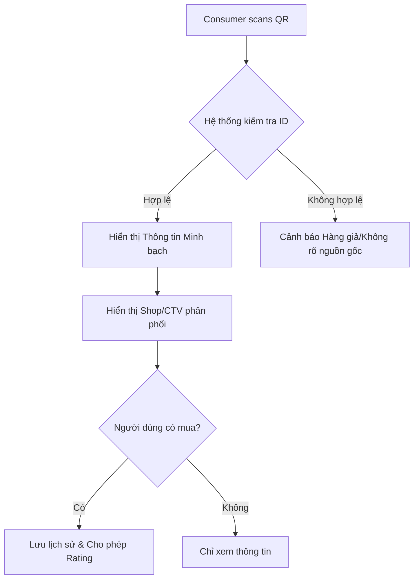
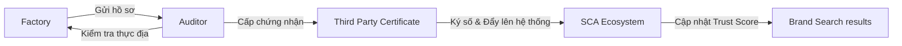

# SCA - Specifications Consumer App: Phân tích & Đề xuất Hệ sinh thái

Chào bạn, ý tưởng về hệ sinh thái **SCA** của bạn rất toàn diện và có tính ứng dụng cao trong xu hướng "Kinh tế minh bạch" (Transparency Economy) và "Tiêu chuẩn bền vững" (ESG). Dưới đây là phần phân tích sâu hơn và các ý tưởng bổ sung để làm cho hệ sinh thái này trở nên chặt chẽ và hấp dẫn hơn.

---

## 1. Phân tích Các Đối Tượng (Stakeholders) & Giá Trị Cốt Lõi

### A. Consumer (Người tiêu dùng) - "The Guardian"
*   **Giá trị:** Niềm tin, sự an toàn và quyền lực chọn lựa sản phẩm đạo đức.
*   **Tính năng bổ sung:** 
    *   **Eco-Score:** Điểm số tổng hợp dựa trên độ bền vững, công bằng và nguồn gốc.
    *   **Verified Purchase Rating:** Chỉ những người đã scan và mua tại Shop mới được đánh giá (chống spam).
    *   **Protection History:** Lưu vết "Digital Passport" của sản phẩm từ lúc scan tại shop đến lúc về nhà.

### B. Intermediaries (Shop, Nhà phân phối, Cộng tác viên)
*   **Giá trị:** Khẳng định uy tín cá nhân/cửa hàng, tăng doanh số nhờ minh bạch.
*   **Tính năng bổ sung:** 
    *   **Check-in Batch:** Khi nhập hàng, Shop quét QR lô hàng để "xác nhận quyền sở hữu tạm thời" tại điểm bán đó.
    *   **Trust Badge:** Shop đạt chuẩn minh bạch cao sẽ có huy hiệu giúp Consumer yên tâm hơn.

### C. Brand Name (Nhãn hàng)
*   **Giá trị:** Quản trị chuỗi cung ứng thời gian thực, bảo vệ thương hiệu khỏi hàng giả/nhái.
*   **Tính năng bổ sung:**
    *   **Supply Chain Heatmap:** Bản đồ trực quan các điểm sản xuất toàn cầu.
    *   **Consumer Insight:** Xem báo cáo về khu vực nào đang scan sản phẩm nhiều nhất.

### D. Factory & Sub-contractors (Nhà máy)
*   **Giá trị:** Hồ sơ năng lực số (Digital Profile) để tiếp cận các Brand lớn toàn cầu.
*   **Tính năng bổ sung:**
    *   **Compliance Roadmap:** Lộ trình các bước cần làm để đạt chứng chỉ quốc tế.
    *   **Worker Feedback (Anonymous):** Hệ thống ghi nhận phản hồi của công nhân để cải thiện môi trường làm việc.

### E. Third Party & Auditor (Đơn vị chứng nhận)
*   **Giá trị:** Công cụ số hóa quy trình đánh giá, tăng tính khách quan.
*   **Tính năng bổ sung:**
    *   **Tamper-proof Reports:** Báo cáo lưu trữ trên Blockchain/Ledger không thể sửa đổi sau khi xuất bản.
    *   **Audit Marketplace:** Nơi các nhà máy tìm kiếm đơn vị kiểm định phù hợp.

---

## 2. Giải pháp Chống Gian Lận (Anti-Fraud Flow)

Để giải quyết vấn đề "tráo sản phẩm" mà bạn lo lắng:
1.  **Serialized QR (QR định danh):** Mỗi sản phẩm là 1 mã QR duy nhất (ID riêng), không phải mã QR chung cho dòng sản phẩm.
2.  **Double-Scan Verification:** 
    *   *Lần 1 (tại Shop):* Consumer scan -> Hệ thống ghi nhận "Product A đang có mặt tại Shop B".
    *   *Lần 2 (khi mua):* Shop xác nhận bán -> Trạng thái đổi thành "Đã bán cho Consumer X".
    *   *Lần 3 (về nhà):* Nếu scan lại, hệ thống báo "Sản phẩm chính chủ của bạn". Nếu bị tráo, mã sẽ không khớp với lịch sử mua.

---

## 3. Phân biệt Giao diện (Color Coding & UI)

Việc phân biệt màu sắc là ý tưởng tuyệt vời để người dùng không bị nhầm lẫn:

| Đối tượng | Màu chủ đạo | Ý nghĩa |
| :--- | :--- | :--- |
| **Consumer** | `Mint Green (#2ECC71)` | Sự tươi mới, bền vững, an tâm. |
| **Shop/CTV** | `Sunflower Yellow (#F1C40F)` | Năng lượng, giao thương, dịch vụ. |
| **Brand** | `Royal Purple (#8E44AD)` | Sang trọng, quản trị, chiến lược. |
| **Factory** | `Steel Blue (#2980B9)` | Công nghiệp, quy trình, độ tin cậy. |
| **Auditor** | `Slate Grey (#7F8C8D)` | Khách quan, tiêu chuẩn, nghiêm túc. |

---

## 4. User Stories & Flows

### User Story: Consumer mua hàng tại Shop
*   **Story:** "Là một khách hàng, tôi muốn quét mã trên hộp sữa để biết nông trại nào sản xuất và cửa hàng này có phải đại lý chính hãng không."
*   **Flow:** Scan QR -> Hiển thị "Origin: Farm A" -> Hiển thị "Seller: Shop B (Verified)" -> Nhấn "Mua" -> Nhận thông báo xác nhận bảo mật.

### User Story: Factory nâng cấp tiêu chuẩn
*   **Story:** "Là quản lý nhà máy, tôi muốn dùng dịch vụ 'Chuyển đổi' để biết những điểm thiếu sót so với tiêu chuẩn ISO/SA8000."
*   **Flow:** Vào mục "Services" -> Chọn "Export Readiness" -> Upload profile hiện tại -> Nhận Checklist khắc phục -> Kết nối với tư vấn viên.

---

## 5. Các Màn Hình Chính (Draft Screens)

1.  **Home (Multi-role):** Tùy login mà hiển thị Dashboard khác nhau.
2.  **The Scanner (Consumer):** Giao diện quét AR (thực tế ảo tăng cường) hiện lên các thông tin bay quanh sản phẩm.
3.  **Inventory/Batch Table (Shop/CTV):** Danh sách các sản phẩm đang có tại shop, trạng thái "Active/Sold".
4.  **Sourcing Hub (Brand):** Thanh tìm kiếm nhà máy theo bộ lọc (Vị trí, Chứng chỉ, Rating).
5.  **Certificate Wallet (Factory):** Nơi lưu trữ tất cả file PDF chứng nhận đã được Third-party xác thực bằng chữ ký số.

---

## 6. Ý tưởng Doanh thu (Monetization)

*   **SaaS Fee:** Phí hàng tháng cho Brand/Factory sử dụng hệ thống quản lý.
*   **Transaction Fee:** Phí môi giới khi Brand tìm được Factory qua Sourcing Hub.
*   **Service Fee:** Phí tư vấn chuyển đổi nhà máy.
*   **Premium Insights:** Báo cáo hành vi tiêu dùng cho Brand.

---

## 7. Quy trình Vận hành (System Flows)

### Quy trình Truy xuất & Xác thực (Consumer Flow)


### Quy trình Chứng nhận (Audit Flow)


---

## 8. Chi tiết các Màn hình (Detailed Screens)

````carousel
```markdown
### Screen: Product Transparency (Consumer)
- **Header:** Tên sản phẩm + Eco-Score (Badge xanh/vàng).
- **Body:** 
  - Traceability Timeline: Từ nông trại -> Nhà máy -> Cảng -> Shop.
  - Workers' Impact: Mức lương so với mức sống tối thiểu, điều kiện làm việc (Ảnh/Video).
  - Certifications: Click vào icon GRS, OEKO-TEX... để xem file thật.
- **Footer:** Shop Info (Tên, địa chỉ, số lần đã bán).
```
<!-- slide -->
```markdown
### Screen: Shop Management (Shop/CTV)
- **Dashboard:** Tổng số sản phẩm đã scan/đã bán.
- **Batch Entry:** Nút "Nhập lô hàng mới" (Quét mã container/thùng).
- **Promotion:** Tăng rank cho shop bằng cách phản hồi feedback của khách nhanh.
- **UI Color:** Vibrant Yellow.
```
<!-- slide -->
```markdown
### Screen: Factory Performance (Factory)
- **Compliance Radar:** Biểu đồ nhện các tiêu chí Sustainability, Social, Quality.
- **Certificate Wallet:** Danh sách chứng chỉ, ngày hết hạn & thông báo nhắc gia hạn.
- **Transition Service:** Banner "Tư vấn xuất khẩu EU/US".
- **UI Color:** Professional Teal/Blue.
```
````

---

## 9. Đề xuất Công nghệ (Technical Recommendations)

*   **Blockchain/Hyperledger:** Để đảm bảo các Transition Certificate (TC) và log truy xuất nguồn gốc không bị sửa đổi.
*   **Dynamic QR Codes:** Mã QR chứa dữ liệu động có thể cập nhật trạng thái (Chưa bán -> Đã bán).
*   **AI Analytics:** Phân tích xu hướng tiêu dùng và dự báo rủi ro chuỗi cung ứng (ví dụ: một vùng nguyên liệu đang có vấn đề về lao động trẻ em).

---

Hy vọng những phân tích và phát thảo này giúp bạn hoàn thiện hệ sinh thái **SCA**. Bạn có muốn tôi thiết kế một bản Mockup giao diện thực tế cho màn hình **Consumer Scan** không?
